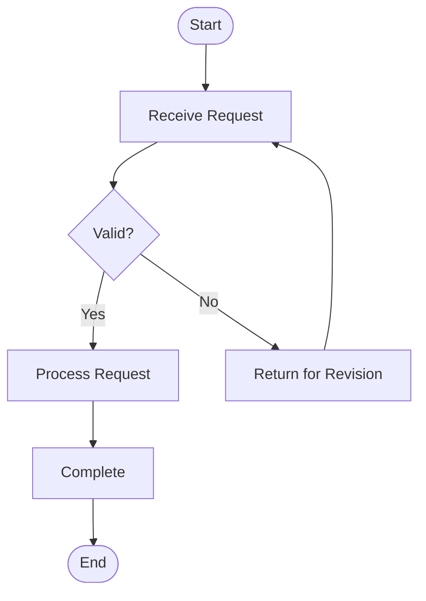
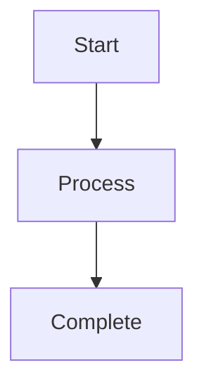
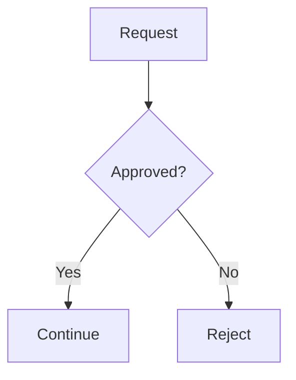
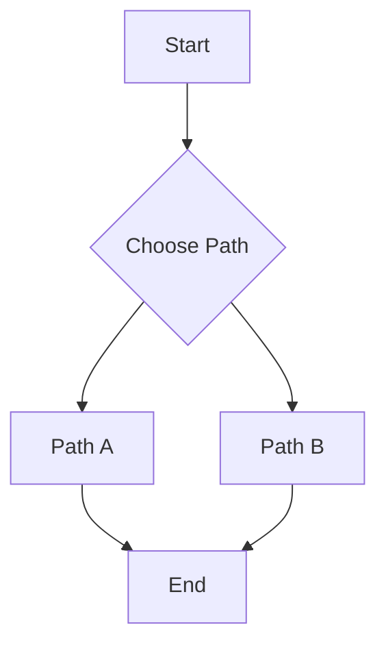

# FlowChart

A lightweight, browser-based flowchart project built with **HTML, CSS, and Mermaid**.

The project provides a simple starting point for creating, visualizing, and maintaining process flowcharts without a build framework.

## Features

- Flowchart rendering with Mermaid
- Responsive browser-based UI
- Easy-to-edit Mermaid source
- Static-site friendly
- No build step required for the basic version

## Project Structure

```text
FlowChart/
├── index.html       # Main web page
├── style.css        # UI styling
├── flowchart.md     # Mermaid flowchart source
└── README.md        # Project documentation
```

## Getting Started

### Clone the repository

```bash
git clone https://github.com/fajarinsanfi-ops/FlowChart.git
cd FlowChart
```

### Run locally

Open `index.html` in a modern browser.

The basic version does not require Node.js, npm, or a build process.

## Editing the Flowchart

The diagram is written using **Mermaid syntax**.

Edit `flowchart.md` to maintain the source definition:



The diagram displayed by `index.html` uses the same Mermaid concept inside the `<pre class="mermaid">` element.

## Mermaid Examples

### Basic process



### Decision



### Multiple paths



## Deployment

This project is a static website and can be deployed with **GitHub Pages**.

Recommended configuration:

```text
Branch: main
Folder: / (root)
```

## Technology

| Technology | Purpose |
|---|---|
| HTML5 | Page structure |
| CSS3 | UI styling |
| Mermaid | Flowchart rendering |
| GitHub | Source control and hosting |

## Roadmap

Potential future improvements:

- Interactive flowchart editor
- Drag-and-drop nodes
- Flowchart templates
- Import/export Mermaid files
- PNG/SVG export
- Dark mode
- Search and filtering
- Process documentation panel
- Shareable flowchart URLs

## License

This project currently has no explicit open-source license.

---

**Repository:** https://github.com/fajarinsanfi-ops/FlowChart
