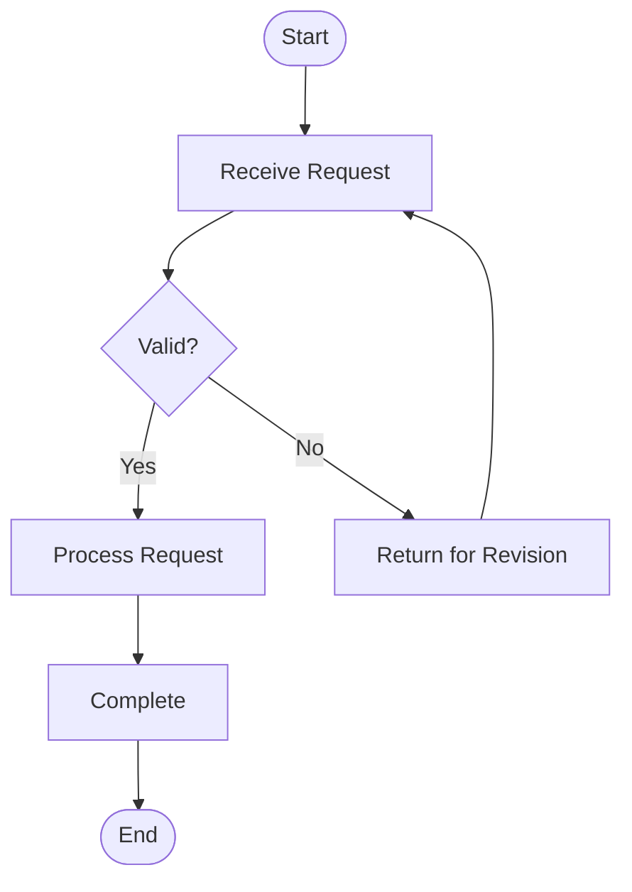

# Example Flowchart

```mermaid
flowchart TD
    A([Start]) --> B[Receive Request]
    B --> C{Valid?}
    C -- Yes --> D[Process Request]
    C -- No --> E[Return for Revision]
    D --> F[Complete]
    E --> B
    F --> G([End])
```
